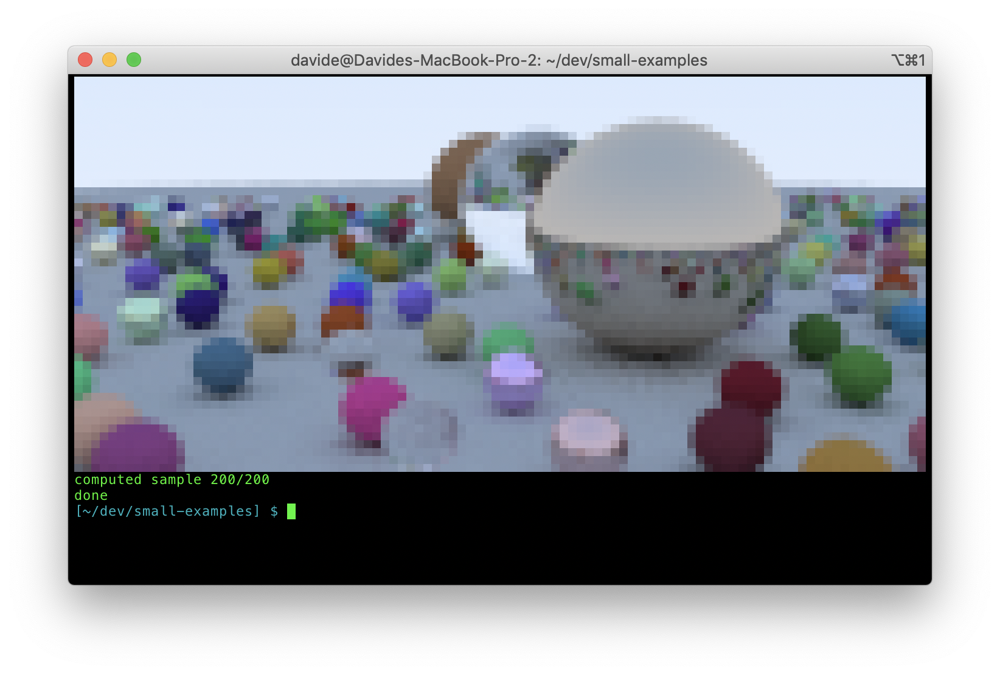

# vmath
Minimalistic math library with 2/3/4-dimensional vectors, matrices and quaternions

[](https://github.com/dbacchet/vmath/actions?query=workflow%3Abuild+branch%3Amaster)
[](https://coveralls.io/github/dbacchet/vmath?branch=master)

This is the rewrite of a library that I used for several years in both personal and professional projects. It's should be 
quite stable, but if you find a bug or want to contribute bugfixes and improvements, please open an issue or a pull request!

## Design

The Vector2/3/4, Matrix2/3/4 and Quaternion classes are minimalistic by design. They only contain setters, accessors and operators;
everything else is implemented as external functions and factories in order to provide more consistency between the functionality that 
is packaged in the library and custom extensions.

The data in the `Vector` classes is accessible using either `x`/`y`/`z` or `r`/`g`/`b` notation, to support both math and color/texture notations.

The data in the `Matrix` classes is stored internally in column-major order, compatible with the default of many graphics API.

I't possible to pass directly a `Vector`/`Matrix` in functions that accept a pointer (like OpenGL); for example:

The classes use templates for the internal data type, but there are convenience typedefs for the most commonly used,
like `Vector3f` (3D vector using `float`s), `Vector3d` (3D vector using `double`s), etc. See the file `vmath_types.h`
for the list of the typedefs that are currently defined.

```c++
using namespace math;
(...)

Matrix4f transform = create_transformation(Vector3f(10,1,0),                               // translation
                                           quat_from_axis_angle(Vector3f(0,0,1), M_PI/3)); // orientation
glUniformMatrix4fv(uniform_id, 1, GL_FALSE, transform);
```
 
## Installation and Usage

Vmath is header-only. In order to use it just copy the files in the `include` folder in your project and you are good to go. 

### precompiled version

It's also possible to use a precompiled version, with the benefit of faster compilation time. To use it, you have to:
1. define `VMATH_COMPILED_LIB` in your project
2. compile the file `vmath_compiled_lib.cpp`

That file declares the classes for the most common types (explicit template instantiation): `int8_t`, `int32_t`, `int64_t`, `float`, `double`.
In case you are using the precompiled version and you need other types, they can easily be added to the same file.

## Building the repository

`vmath` uses [bazel](https://bazel.build/) as build system. 
To build `vmath` and run the unit tests, you need a recent version of bazel (the project has been developed with bazel 
2.2.0, but any version >1.2.0 should work fine) and a compiler that is not from the previous millennium.

If you have docker, the repository contains a `Dockerfile` that can be used to build an ubuntu 18.04 image with all the 
required tools. To build and run the container, you can just run the command:
```
./docker/run.sh
```
from inside the repository. When the container is started, the repository will be mapped in `/code` and you can run the 
following command to build everything:
```
root@3e4335a3e71f:/code# bazel build //...
```
To build everything and run the unit tests, call"
```
root@3e4335a3e71f:/code# bazel test //...
```
It's also possible to generate a code coverage report using the following command:
```
root@3e4335a3e71f:/code# bazel coverage --combined_report=lcov //... --test_output=errors && genhtml -o report bazel-out/_coverage/_coverage_report.dat
```

If you want to use `vmath` in a project that is built with [bazel](https://bazel.build/) you can just add the following
snippet in your `WORKSPACE` file:
```
git_repository(
    name = "vmath",
    remote = "https://github.com/dbacchet/vmath.git",
    commit = "ac4c326af0cf9c211d3feb92b99f909473eedcc8", # replace this with the sha of the commit you want to use
    shallow_since = "1586239353 -0700"
)
```
For an example of a toy project that uses `vmath` (and is built with bazel), you can have a look at the
[small-examples](https://github.com/dbacchet/small-examples) repository.
The folder `path_tracer_vmath` contains a simple path tracer that will generate the following image in the terminal:

(you need to have a terminal with full-color support in order to correctly visualize it)
